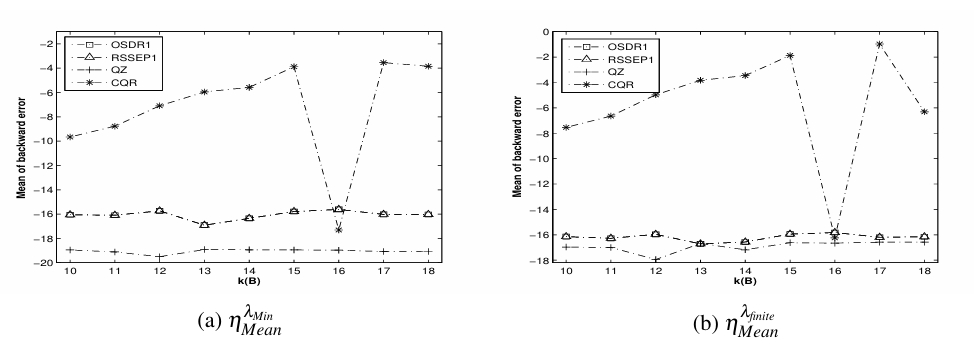
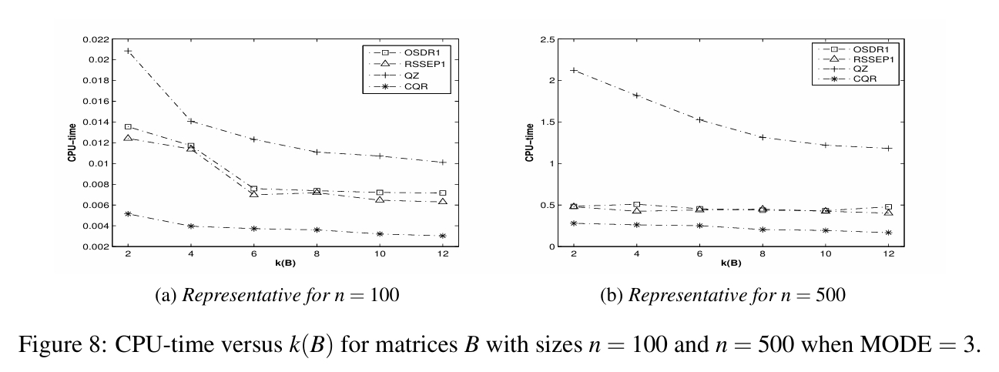
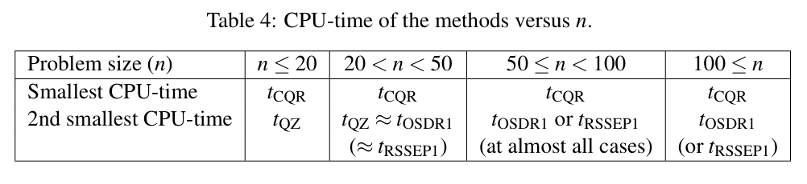

# Symmetric-Diagonal Reductions for Generalized Eigenvalue Solvers

This repository presents a short showcase of the method introduced in our paper:

**"Symmetric-diagonal reductions as preprocessing for symmetric positive definite generalized solvers"**  
Morad Ahmadnasab, [Journal of Mathematical Modeling, 2023].  
[DOI: 10.22124/JMM.2023.23734.2120 ]

---

## 🔎 Overview
Efficient solution of generalized symmetric positive definite eigenvalue problems  
\[
A x = \lambda B x
\]
is crucial in many areas of scientific computing.  
Our work introduces some **symmetric-diagonal reduction preprocessing technique** that improves the **stability** of standard solvers, while maintaining efficiency close to optimized methods.

---

## ✨ Key Contributions
- A novel **symmetric-diagonal reduction** for generalized eigenvalue problems.  
- Demonstrates **better conditioning** and **robustness** compared to classical approaches.  
- Applicable as a **preprocessing step** to a wide range of eigenvalue solvers.  

---

## 📊 Figures

  

  

  

---

## 📄 Reference
If you use or refer to this work, please cite: M. Ahmadnasab, Symmetric-diagonal reductions as preprocessing for symmetric positive definite generalized eigenvalue solvers, Journal of Mathematical Modeling, 11 (2023) 301-322. 

